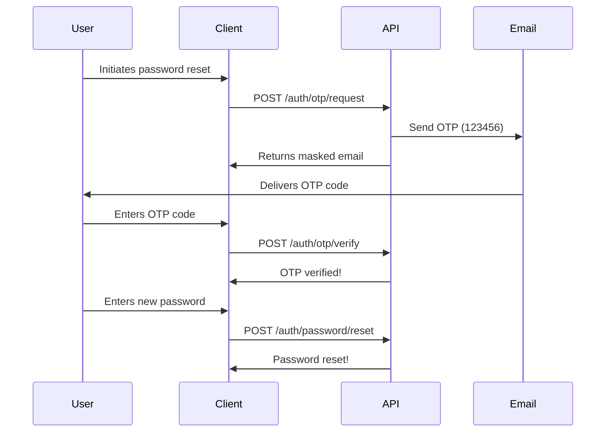

## Overview

The OTP (One-Time Password) authentication system provides secure passwordless authentication and password reset functionality. OTPs are 6-digit codes sent via email that expire after a set duration.

## Request OTP

### Endpoint

```
POST /v1/auth/otp/request
```

### Authentication

No authentication required. This is a public endpoint.

### Rate Limits

- **3 requests per 60 minutes** per IP address
- Returns `429 Too Many Requests` when limit is exceeded

### Request Body

<ParamField body="identifier" type="string" required>
  User's email address or username to send the OTP to
</ParamField>

<ParamField body="description" type="string">
  Optional context for the OTP email (e.g., "Password Reset", "Login Verification")
</ParamField>

### Example Request

```json
{
  "identifier": "user@example.com",
  "description": "Password Reset"
}
```

### Success Response (200 OK)

<ResponseField name="success" type="boolean">
  Indicates the request was successful
</ResponseField>

<ResponseField name="message" type="string">
  Success message: "OTP sent!"
</ResponseField>

<ResponseField name="data" type="string">
  Masked email address showing where the OTP was sent (e.g., "u***@example.com")
</ResponseField>

### Example Success Response

```json
{
  "success": true,
  "message": "OTP sent!",
  "data": "u***@example.com"
}
```

### Error Responses

#### 400 Bad Request - User Not Found

```json
{
  "success": false,
  "message": "user not found"
}
```

#### 422 Unprocessable Entity - Validation Error

```json
{
  "success": false,
  "message": "validation failed",
  "errors": [
    {
      "field": "identifier",
      "message": "identifier is required"
    }
  ]
}
```

#### 429 Too Many Requests

```json
{
  "success": false,
  "message": "rate limit exceeded"
}
```

---

## Verify OTP

### Endpoint

```
POST /v1/auth/otp/verify
```

### Authentication

No authentication required. This is a public endpoint.

### Rate Limits

- **4 requests per 10 minutes** per IP address
- Returns `429 Too Many Requests` when limit is exceeded

### Request Body

<ParamField body="identifier" type="string" required>
  User's email address or username (same as used in request)
</ParamField>

<ParamField body="otp" type="string" required>
  6-digit OTP code received via email
</ParamField>

### Example Request

```json
{
  "identifier": "user@example.com",
  "otp": "123456"
}
```

### Success Response (200 OK)

<ResponseField name="success" type="boolean">
  Indicates the OTP was verified successfully
</ResponseField>

<ResponseField name="message" type="string">
  Success message: "OTP verified!"
</ResponseField>

### Example Success Response

```json
{
  "success": true,
  "message": "OTP verified!"
}
```

### Error Responses

#### 400 Bad Request - Invalid OTP

```json
{
  "success": false,
  "message": "invalid code provided, please request a new one"
}
```

#### 400 Bad Request - Expired OTP

```json
{
  "success": false,
  "message": "invalid code provided, please request a new one"
}
```

#### 422 Unprocessable Entity - Validation Error

```json
{
  "success": false,
  "message": "validation failed",
  "errors": [
    {
      "field": "otp",
      "message": "otp must be exactly 6 characters"
    }
  ]
}
```

---

## Reset Password with OTP

### Endpoint

```
POST /v1/auth/password/reset
```

### Authentication

No authentication required. Requires a valid OTP.

### Rate Limits

- **10 requests per 30 minutes** per IP address
- Returns `429 Too Many Requests` when limit is exceeded

### Request Body

<ParamField body="identifier" type="string" required>
  User's email address or username
</ParamField>

<ParamField body="token" type="string" required>
  6-digit OTP code received via email (must be verified first)
</ParamField>

<ParamField body="password" type="string" required>
  New password for the account. Minimum 6 characters.
</ParamField>

### Example Request

```json
{
  "identifier": "user@example.com",
  "token": "123456",
  "password": "newSecurePassword123"
}
```

### Success Response (200 OK)

<ResponseField name="success" type="boolean">
  Indicates the password was reset successfully
</ResponseField>

<ResponseField name="message" type="string">
  Success message: "password reset!"
</ResponseField>

### Example Success Response

```json
{
  "success": true,
  "message": "password reset!"
}
```

### Error Responses

#### 400 Bad Request - Invalid or Expired OTP

```json
{
  "success": false,
  "message": "invalid code provided, please request a new one"
}
```

#### 400 Bad Request - Weak Password

```json
{
  "success": false,
  "message": "password must be at least 6 characters"
}
```

#### 422 Unprocessable Entity - Validation Error

```json
{
  "success": false,
  "message": "validation failed",
  "errors": [
    {
      "field": "password",
      "message": "password must be at least 6 characters"
    }
  ]
}
```

---

## Code Examples

<CodeGroup>

```bash cURL - Request OTP
curl -X POST https://api.cultus.io/v1/auth/otp/request \
  -H "Content-Type: application/json" \
  -d '{
    "identifier": "user@example.com",
    "description": "Password Reset"
  }'
```

```bash cURL - Verify OTP
curl -X POST https://api.cultus.io/v1/auth/otp/verify \
  -H "Content-Type: application/json" \
  -d '{
    "identifier": "user@example.com",
    "otp": "123456"
  }'
```

```bash cURL - Reset Password
curl -X POST https://api.cultus.io/v1/auth/password/reset \
  -H "Content-Type: application/json" \
  -d '{
    "identifier": "user@example.com",
    "token": "123456",
    "password": "newSecurePassword123"
  }'
```

```javascript JavaScript - Full Flow
// Step 1: Request OTP
async function requestOTP(identifier) {
  const response = await fetch('https://api.cultus.io/v1/auth/otp/request', {
    method: 'POST',
    headers: {
      'Content-Type': 'application/json',
    },
    body: JSON.stringify({
      identifier,
      description: 'Password Reset',
    }),
  });
  
  const data = await response.json();
  console.log(`OTP sent to: ${data.data}`);
  return data.success;
}

// Step 2: Verify OTP
async function verifyOTP(identifier, otp) {
  const response = await fetch('https://api.cultus.io/v1/auth/otp/verify', {
    method: 'POST',
    headers: {
      'Content-Type': 'application/json',
    },
    body: JSON.stringify({ identifier, otp }),
  });
  
  const data = await response.json();
  return data.success;
}

// Step 3: Reset Password
async function resetPassword(identifier, token, password) {
  const response = await fetch('https://api.cultus.io/v1/auth/password/reset', {
    method: 'POST',
    headers: {
      'Content-Type': 'application/json',
    },
    body: JSON.stringify({ identifier, token, password }),
  });
  
  const data = await response.json();
  return data.success;
}

// Usage
await requestOTP('user@example.com');
// User receives OTP via email: 123456
await verifyOTP('user@example.com', '123456');
await resetPassword('user@example.com', '123456', 'newPassword123');
```

```python Python - Full Flow
import requests

def request_otp(identifier):
    url = 'https://api.cultus.io/v1/auth/otp/request'
    response = requests.post(url, json={
        'identifier': identifier,
        'description': 'Password Reset'
    })
    result = response.json()
    print(f"OTP sent to: {result['data']}")
    return result['success']

def verify_otp(identifier, otp):
    url = 'https://api.cultus.io/v1/auth/otp/verify'
    response = requests.post(url, json={
        'identifier': identifier,
        'otp': otp
    })
    result = response.json()
    return result['success']

def reset_password(identifier, token, password):
    url = 'https://api.cultus.io/v1/auth/password/reset'
    response = requests.post(url, json={
        'identifier': identifier,
        'token': token,
        'password': password
    })
    result = response.json()
    return result['success']

# Usage
request_otp('user@example.com')
# User receives OTP via email: 123456
verify_otp('user@example.com', '123456')
reset_password('user@example.com', '123456', 'newPassword123')
```

```go Go - Request OTP
package main

import (
    "bytes"
    "encoding/json"
    "fmt"
    "net/http"
)

type OTPRequest struct {
    Identifier  string `json:"identifier"`
    Description string `json:"description"`
}

type OTPResponse struct {
    Success bool   `json:"success"`
    Message string `json:"message"`
    Data    string `json:"data"`
}

func requestOTP(identifier string) error {
    url := "https://api.cultus.io/v1/auth/otp/request"
    
    payload := OTPRequest{
        Identifier:  identifier,
        Description: "Password Reset",
    }
    
    jsonData, _ := json.Marshal(payload)
    
    resp, err := http.Post(url, "application/json", bytes.NewBuffer(jsonData))
    if err != nil {
        return err
    }
    defer resp.Body.Close()
    
    var result OTPResponse
    json.NewDecoder(resp.Body).Decode(&result)
    
    if result.Success {
        fmt.Printf("OTP sent to: %s\n", result.Data)
    }
    
    return nil
}

func main() {
    requestOTP("user@example.com")
}
```

</CodeGroup>

## OTP Flow Diagram



## Notes

- OTPs are 6-digit numeric codes (e.g., "123456")
- OTP codes are stored as hashed values in Redis cache
- OTP expiration time is configured in the cache settings
- The same OTP is used for both verification and password reset
- After successful password reset, the OTP is deleted from cache
- Failed OTP verification attempts count toward rate limit
- The `identifier` field accepts both email addresses and usernames
- Email addresses are masked in responses for privacy (e.g., "u***@example.com")

## Security Considerations

- OTPs are hashed before storage using cryptographic hashing
- Rate limiting prevents brute force attacks
- OTPs expire after a set duration (configured in cache settings)
- Each OTP can only be used once for password reset
- The verification step is optional but recommended before password reset
- OTP requests are logged for security monitoring

## Related Endpoints

- [POST /auth/login](/api/auth/login) - Login after password reset
- [POST /auth/verification/verify](/api/auth/verify) - Email verification (different from OTP)
- [POST /user/change-password](/api/user/change-password) - Change password while authenticated
