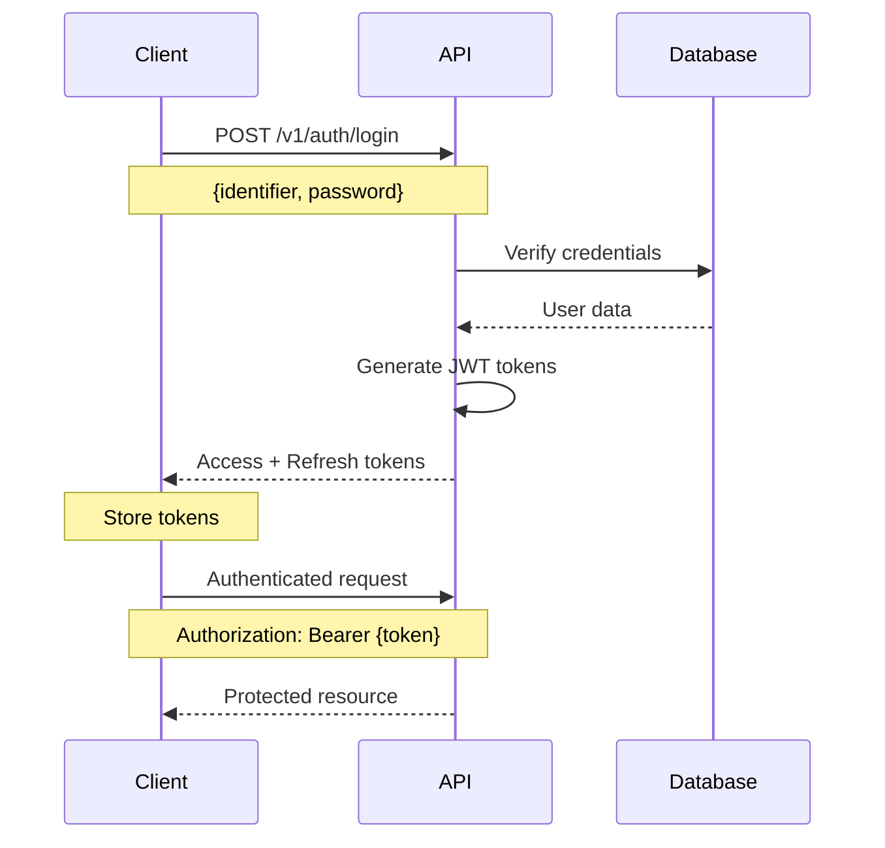
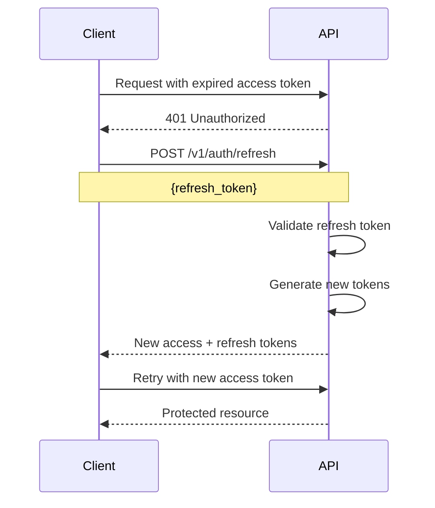

## Overview

The Cultus API (Linkvite backend) provides multiple authentication methods to secure access to your resources. Choose the method that best fits your use case.

## Authentication Methods

### Email/Password Authentication

Traditional username/email and password authentication. This is the primary authentication method for end users.

**Use cases:**
- Web and mobile applications
- User account creation and login
- Session-based authentication

**Learn more:** [JWT Tokens](/auth/jwt-tokens)

### OAuth 2.0 Provider

Cultus acts as an OAuth 2.0 provider, allowing third-party applications to access user data with explicit permission.

**Use cases:**
- Third-party integrations
- Mobile apps connecting to user accounts
- Partner applications

**Learn more:** [OAuth 2.0](/auth/oauth)

### API Keys

Long-lived authentication tokens for server-to-server communication and automation.

**Use cases:**
- Backend services and integrations
- Automated scripts and workflows
- Server-to-server communication
- Pro users only

**Learn more:** [API Keys](/auth/api-keys)

### One-Time Password (OTP)

Email-based OTP authentication for password reset and account verification.

**Use cases:**
- Password reset flows
- Account email verification
- Two-factor authentication scenarios

**Endpoints:**
- `POST /v1/auth/otp/request` - Request an OTP
- `POST /v1/auth/otp/verify` - Verify an OTP
- `POST /v1/auth/reset-password` - Reset password with OTP

### QR Code Authentication

Quick authentication using QR codes for mobile-to-web session transfer.

**Use cases:**
- Mobile app to web app authentication
- Quick login without typing credentials
- Cross-device authentication

**Flow:**
1. Web app requests QR auth session
2. Mobile app scans QR code
3. Mobile app confirms authentication
4. Web app receives authentication tokens

### Social Authentication

Sign in with external OAuth providers.

**Supported providers:**
- Google OAuth
- Apple Sign-In

**Endpoints:**
- `POST /v1/auth/google` - Authenticate with Google
- `POST /v1/auth/apple` - Authenticate with Apple

## Basic Authentication Flow

### Password-Based Login

### Token Refresh Flow

## Token Types

### Access Token
- **Type:** JWT (JSON Web Token)
- **Expiration:** 30 minutes
- **Usage:** Include in `Authorization` header for API requests
- **Format:** `Authorization: Bearer {access_token}`

### Refresh Token
- **Type:** JWT (JSON Web Token)
- **Expiration:** 30 days
- **Usage:** Obtain new access tokens when they expire
- **Endpoint:** `POST /v1/auth/refresh`

## Security Best Practices

<Warning>
  Never expose your authentication tokens, API keys, or client secrets in client-side code or public repositories.
</Warning>

### For Client Applications

- Store tokens securely (e.g., HttpOnly cookies, secure storage)
- Implement token refresh logic before expiration
- Clear tokens on logout
- Use HTTPS for all API communication

### For Server Applications

- Rotate API keys regularly
- Use environment variables for secrets
- Implement rate limiting
- Monitor API key usage

### For OAuth Applications

- Validate redirect URIs strictly
- Request minimum required scopes
- Store client secrets securely
- Implement PKCE for public clients

## Common Endpoints

| Endpoint | Method | Description |
|----------|--------|-------------|
| `/v1/auth/signup` | POST | Create new user account |
| `/v1/auth/login` | POST | Authenticate user |
| `/v1/auth/logout` | POST | Invalidate session |
| `/v1/auth/refresh` | POST | Refresh access token |
| `/v1/auth/otp/request` | POST | Request OTP for password reset |
| `/v1/auth/otp/verify` | POST | Verify OTP code |
| `/v1/auth/reset-password` | POST | Reset password with OTP |
| `/v1/auth/verify-account` | POST | Verify email address |
| `/v1/auth/google` | POST | Google OAuth authentication |
| `/v1/auth/apple` | POST | Apple Sign-In authentication |

## Next Steps

<CardGroup cols={2}>
  <Card title="JWT Tokens" icon="key" href="/auth/jwt-tokens">
    Learn about JWT token structure, claims, and usage
  </Card>
  <Card title="OAuth 2.0" icon="shield" href="/auth/oauth">
    Implement OAuth 2.0 provider flows
  </Card>
  <Card title="API Keys" icon="code" href="/auth/api-keys">
    Generate and use API keys for automation
  </Card>
</CardGroup>
